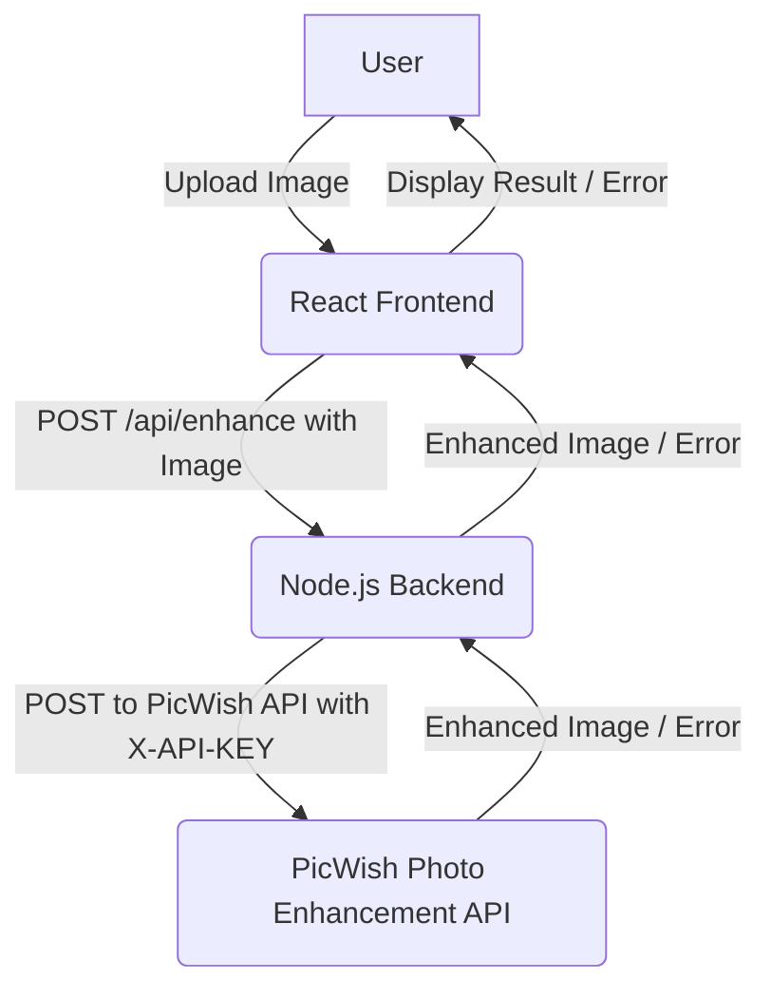

# AI Image Enhancer

## Short Project Description
A React-based web application that allows users to upload images and enhance them using the PicWish Photo Enhancement API. The application provides a simple user interface for image upload, displays the original and enhanced images, and handles API communication and error reporting.

## Problem Statement / Purpose
Many users need to quickly enhance the quality of their images without requiring complex photo editing software. This project aims to provide an accessible and easy-to-use web tool for image enhancement, leveraging a powerful external API to deliver high-quality results.

## Features
*   **Image Upload:** Users can upload images via drag-and-drop or file selection.
*   **Image Preview:** Displays the original uploaded image.
*   **AI Enhancement:** Sends the uploaded image to the PicWish API for enhancement.
*   **Enhanced Image Display:** Shows the processed image returned by the API.
*   **Loading Indicator:** Provides visual feedback during the enhancement process.
*   **Error Handling:** Displays user-friendly error messages for API failures or network issues.
*   **Responsive Design:** Works across various devices and screen sizes.

## Tech Stack
*   **Frontend:**
    *   React (with Vite)
    *   Tailwind CSS
*   **Backend:**
    *   Node.js
    *   Express.js
    *   `multer` for handling multipart/form-data
    *   `node-fetch` for making HTTP requests
    *   `form-data` for constructing multipart/form-data requests
    *   `dotenv` for environment variable management
*   **API:**
    *   PicWish Photo Enhancement API

## System Architecture / High-Level Design
The application follows a client-server architecture:

1.  **Frontend (React App):**
    *   Handles user interaction, image selection, and display.
    *   Sends image upload requests to the custom Node.js backend.
2.  **Backend (Node.js/Express Server):**
    *   Receives image files from the frontend.
    *   Acts as a proxy to the PicWish Photo Enhancement API.
    *   Constructs and sends requests to the PicWish API, including the API key.
    *   Receives the enhanced image or error from PicWish.
    *   Forwards the enhanced image or appropriate error messages back to the frontend.
3.  **PicWish Photo Enhancement API:**
    *   Processes the image and returns an enhanced version or an error.



## Folder Structure
```
.
├── public/
├── src/
│   ├── assets/
│   │   └── generated-image.png
│   ├── components/
│   │   ├── ImageUpload.jsx
│   │   ├── Loading.jsx
│   │   └── ImagePreview.jsx (not currently used, but exists)
│   ├── App.jsx
│   ├── Home.jsx
│   └── main.jsx
├── server/
│   ├── index.js
│   └── test_api.js (for testing API connectivity)
├── .env
├── .gitignore
├── index.html
├── package.json
├── vite.config.js
└── README.md
```

## Installation Instructions

1.  **Clone the repository:**
    ```bash
    git clone <repository_url>
    cd my-react-app
    ```
2.  **Install frontend dependencies:**
    ```bash
    npm install
    ```
3.  **Install backend dependencies:**
    ```bash
    # Dependencies are listed in package.json, npm install covers both
    ```

## Environment Variables
Create a `.env` file in the root directory of the project (`my-react-app/`) and add your PicWish API key:

```
PICWISH_API_KEY=your_picwish_api_key_here
```
You can obtain a free API key from the PicWish website.

## How to Run the Project

1.  **Start the backend server:**
    ```bash
    npm run server
    ```
    The server will run on `http://localhost:8080`.

2.  **Start the frontend development server:**
    ```bash
    npm run dev
    ```
    This will typically open the application in your browser at `http://localhost:5173` (or another available port).

## API Endpoints
### Backend (Node.js/Express)
*   **`POST /api/enhance`**
    *   **Description:** Receives an image file, sends it to the PicWish API for enhancement, and returns the enhanced image.
    *   **Request:** `multipart/form-data` with a field named `image` containing the image file.
    *   **Response:**
        *   `200 OK`: Returns the enhanced image as a `Blob` with the appropriate `Content-Type`.
        *   `400 Bad Request`: If no image file is uploaded.
        *   `500 Internal Server Error`: If the API key is missing, the PicWish API returns an error, or other server-side issues occur.

### External API (PicWish Photo Enhancement API)
*   **Endpoint:** `https://techhk.aoscdn.com/api/tasks/visual/scale`
*   **Method:** `POST`
*   **Headers:**
    *   `X-API-KEY`: Your PicWish API key.
    *   `Content-Type`: `multipart/form-data` (handled by `form-data` library).
*   **Body (multipart/form-data):**
    *   `image_file`: The image file to be enhanced.
    *   `sync`: `1` (for synchronous processing).

## Error Handling Strategy
*   **Frontend:**
    *   Displays user-friendly error messages in the UI if the backend request fails or returns an error.
    *   Catches network errors (e.g., server not running).
*   **Backend:**
    *   Validates the presence of the API key and uploaded image.
    *   Handles HTTP errors from the PicWish API.
    *   Parses PicWish API responses and checks for internal API error statuses (`status` field in JSON response) and task states (`data.state`).
    *   Logs detailed error information to the console for debugging.
    *   Returns appropriate HTTP status codes and error messages to the frontend.

## Security Measures
*   **API Key Protection:** The PicWish API key is stored in a `.env` file and accessed via `process.env`, preventing it from being exposed in the client-side code or committed to version control.
*   **CORS:** The backend is configured with `cors` to allow requests from the frontend, preventing cross-origin issues while maintaining security.
*   **Input Validation:** Basic validation for image file presence is performed on the backend.

## Performance Optimizations
*   **Asynchronous API Calls:** The backend uses `async/await` for non-blocking API calls to PicWish.
*   **Image Buffer Handling:** Images are processed as buffers, avoiding saving temporary files to disk.
*   **Increased Timeout:** The API request timeout has been increased to accommodate longer processing times for image enhancement.

## Challenges Faced
*   **PicWish API Integration:** Understanding the specific `multipart/form-data` requirements, header naming (`X-API-KEY`), and the structure of success/error responses (especially the internal `status` and `data.state` fields) from the PicWish API documentation.
*   **Error Debugging:** Distinguishing between HTTP errors and API-specific logical errors within the JSON response.
*   **Local Testing:** Initially, using a minimal 1x1 pixel image for API testing led to a "file size too small" error, which was resolved by using a larger sample image or a local image file.

## Learnings
*   The importance of thorough API documentation review, especially for specific parameter names and response structures.
*   Implementing robust error handling that accounts for both HTTP status codes and internal API-specific error codes.
*   Best practices for handling environment variables in Node.js applications.
*   Configuring `multer` and `form-data` for seamless file uploads in a Node.js proxy server.

## Future Enhancements
*   **Image Download:** Add a button to download the enhanced image.
*   **Multiple Image Upload:** Allow users to upload and enhance multiple images simultaneously.
*   **Enhancement Options:** Integrate more PicWish API features (e.g., different enhancement levels, other visual tasks).
*   **User Authentication:** Implement user accounts to track usage or provide personalized features.
*   **Frontend Loading States:** More granular loading states and progress indicators.
*   **Dockerization:** Containerize the application for easier deployment.

## Limitations / Known Issues
*   **API Rate Limits:** Subject to PicWish API rate limits and usage quotas.
*   **Image Size/Resolution:** Limited by PicWish API's supported image formats, resolutions, and file sizes (up to 4096x4096, 20MB).
*   **No Client-Side Image Pre-processing:** Currently, no client-side image resizing or compression is performed before upload.

## Contribution Guidelines
(If this project were open-source)
1.  Fork the repository.
2.  Create a new branch (`git checkout -b feature/YourFeature`).
3.  Make your changes.
4.  Commit your changes (`git commit -m 'Add some feature'`).
5.  Push to the branch (`git push origin feature/YourFeature`).
6.  Open a Pull Request.

## License
This project is licensed under the MIT License.

## Author / Contact Information
*   **Author:** Vipeen
*   **GitHub:** [[Vipeen Kumar](https://github.com/Vipeen-Kumar)]
*   **Email:** [[vipeen@example.com](mailto:vipeen@example.com)]
